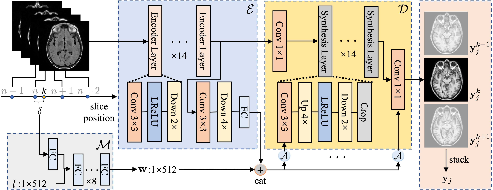

## AFCM: Alias-Free Co-Modulated Network for Cross-Modality Synthesis and Super-Resolution of MR Images

**Official PyTroch implementation of the *MICCAI 2023* paper**<br></sub>

<div align="center">
  
</div>

**Alias-Free Co-Modulated Network for Cross-Modality Synthesis and Super-Resolution of MR Images**<br>
Zhiyun Song, Xin Wang, Xiangyu Zhao, Sheng Wang, Zhenrong Shen, Zixu Zhuang, Mengjun Liu, Qian Wang, Lichi Zhang<br>

Abstract: *Cross-modality synthesis (CMS) and super-resolution (SR) have both been extensively studied with learning-based methods, which aim to synthesize desired modality images and reduce slice thickness for magnetic resonance imaging (MRI), respectively.  It is also desirable to build a network for simultaneous cross-modality and super-resolution (CMSR) so as to further bridge the gap between clinical scenarios and research studies. However, these works are limited to specific fields. None of them can flexibly adapt to various combinations of resolution and modality, and perform CMS, SR, and CMSR with a single network. Moreover, alias frequencies are often treated carelessly in these works, leading to inferior detail-restoration ability. In this paper, we propose Alias-Free Co-Modulated network (AFCM) to accomplish all the tasks with a single network design. To this end, we propose to perform CMS and SR consistently with co-modulation, which also provides the flexibility to reduce slice thickness to various, non-integer values for SR. Furthermore, the network is redesigned to be alias-free under the Shannon-Nyquist signal processing framework, ensuring efficient suppression of alias frequencies. Experiments on three datasets demonstrate that AFCM outperforms the alternatives in CMS, SR, and CMSR of MR images.*

## Release notes

This repository is built upon [CycleGAN and pix2pix in PyTorch](https://github.com/junyanz/pytorch-CycleGAN-and-pix2pix) and depends on [Alias-Free GAN](https://github.com/NVlabs/stylegan3) for the alias-free generator.

## Requirements

* We recommend Linux for performance and compatibility reasons.
* 1 high-end NVIDIA GPUs with at least 24 GB of memory.
* CUDA toolkit 10.2 or later.  Use at least version 11.1 if running on RTX 3090.  (Why is a separate CUDA toolkit installation required?  See comments in [#2](https://github.com/NVlabs/stylegan2-ada-pytorch/issues/2#issuecomment-779457121).)
* 64-bit Python 3.8 and PyTorch 1.9.1. See [https://pytorch.org/](https://pytorch.org/) for PyTorch install instructions. One way to install Pytorch 1.9.1, which has been verify by the author, is:
`pip install torch==1.9.1+cu111 torchvision==0.10.1+cu111 torchaudio==0.9.1 -f https://download.pytorch.org/whl/torch_stable.html`
*  Other dependencies: `pip install -r requirements.txt`

## Preparing datasets

Please make sure that the MR images of a subject have the same shape, which means you should pre-resample the LR image using nearest intepolation. The first slice of the MR images should be strictly aligned.

The datasets for training should be reformatted as the h5py file. Please refer to `./data/prepare_h5.py` for preparing the dataset.

Then, you need to split the dataset into training/validation/testing by putting them in the corresponding subdirs.

## Getting started
For cross-modality synthesis, you can follow our settings with
```.bash
python train.py --config-file ./configs/ixi/T1/stylegan3/translation.yml --model stylegan3
```
For super-resolution, you can follow our settings with
```.bash
python train.py --config-file ./configs/adni/stylegan3/sr_5.yml --model stylegan3
```
For simultaneous cross-modality synthesis and super-resolution, you can follow our settings with
```.bash
python train.py --config-file ./configs/adni/stylegan3/cmsr.yml --model stylegan3
```

Once finishing training, you may get the results and the evaluation metrics by running
```.bash
python evaluate.py --config-file same/with/training.yml epoch latest
```

## Citation

This will be updated once the paper is officially published

## Development

This is a research reference implementation and is treated as a one-time code drop. As such, we do not accept outside code contributions in the form of pull requests.

